Template tirée : https://www.dokchess.de/en/00_overview/ 

Introduction and Goals
======================

Le but de cette application d'effectuer la gestion des ventes, de stocks, de produits, et des rapports pour les utilisateurs finaux. Pour y arriver, il faut respecter également les qualités de systèmes, les contraintes mises sur l'architecture et les besoins des parties prenantes importantes.

Requirements overview
---------------------
Le but de cette exercice est de développer une système de point de vente pour une entreprise contenant des magasins, permettant également la gestion des magasins et de leurs produits. 

Fonctionnalités essentielles:
- Rechercher un produit
- Acheter un produit
- Générer un rapport consolidé des ventes
- Consulter le stock central 
- Déclencher un réapprovisionnement 
- Visualiser les performances des magasins dans un tableau de bord

Voici une liste non-exhaustive d'exigences fonctionnelles et non fonctionnelles de ce système : 

### Exigences fonctionnelles 
- Le gestionnaire peut visualiser les performances de chaque magasin, soit les chiffres d'affaires par magasin, les alertes de ruptures de stock et les produits en surstock
- Le gestionnaire peut générer un rapport des ventes par magasin
- Le gestionnaire et un employé peut consulter le stock central 
- L'employé peut déclencher un réapprovisionnement pour un produit ayant un stock local petit. 
- Un utilisateur peut commander un produit via la caisse ou avec la gestion ecommerce

### Exigences non-fonctionnelles
- Le système doit être testable avec les tests unitaires et tests d'intégrations.
- Le système doit être capable de visualiser les modeles domaines majeurs
- Le système doit être simple (ayant que deux couches), et facile à utiliser et déployer.
---------------------

Quality Goals 
-------------

| Attributs de qualité   | Motivation / Description                           |
| -----------------------| -------------------------------------------------- |
| Maintenabilité         | L'utilisation de tests et l'architecture 3-tier facilite la compréhension du système, permettant aux nouveaux développeurs de s'adapter au code rapidement. Les bugs sont rapidement corrigés en conséquence.                                          |
| Évolutivitité            | Le système est capable de s'adapter facilement à de nouveaux besoins et à une agumentation du nombre d'utilisateurs , et ce, sans changement majeurs de code.                               |
| Utilisabilité          | Le système présente une interface claire et simple, et ce, sans erreurs majeurs qui pourrait perturbé l'expérience du client. Les cas d'utilisation sont clairement divisé dans le UI.               |
| Performance         | Le système doit permettre de repondre aux requetes du browser dans les délais les plus rapides, même quand la charge devient importante.   |
| Rigidité         | Le système doit pouvoir réagir adéquatement face à des pannes.  |
| Simplicité | Ne pas overengineer |  

Stakeholders
------------

| Role/Name   | Contact                   | Expectations              |
| ----------- | ------------------------- | ------------------------- |
| Fabio Petrillo      | 	fabio.petrillo@etsmtl.ca	              | Product Owner   |
| Lojan Arunasalam      | lojan.arunasalam.1@ens.etsmtl.ca                | Responsable de l'architecture du système -- Developpeur du système   |

Architecture Constraints
========================
| Contrainte   | Background ou motivation|
| ----------- | ------------------------- |
| Implémentation en Python       | Le projet est developpé en Python et doit rester en Python, sauf à indication contraire. |
| Architecture microservices      | Le projet doit être en architecture microservices pour résoudre les problèmes de scalabilité et de performance identifiés dans l'architecture monolithique. Cette contrainte impose une séparation claire des domaines métiers et l'utilisation d'un API Gateway pour la communication inter-services. |
| DDD     | Le projet doit appliquer des principes DDD pour structurer les microservices selon les domaines métiers identifiés (Users, Products, Ecommerce, Warehouse). Cette contrainte garantit une séparation logique des responsabilités. |

### Tableau de choix de technologies
Voici un tableau qui démontre les technologies utilisées dans ce système

| Element | Technologie | Justification |
| --- | ----------- | -------------- | 
| Language | Python | Facile à utiliser
| Web Framework | Django | Framework très populaire permettant l'architecture MVC, et une évolution vers une utilisation d'API
| ORM | SQLAlchemy | Mécanisme de persistence bien documenté dans Python
| Base de données | PostgreSQL | Robuste et offre plus de fonctionnalités que SQLite et n'est pas en local
| Conteneurisation | Docker | Conteneuriser l'application, pour pouvoir la rouler dans la VM de production
| CI/CD | Github Actions | Automatiser le processus de test et déploiement après des changements effectués dans le code
| API application | Django REST framework | Robuste et y déjà compris dans l'écosystème, donc intégration facile.  
| API microservices | FastAPI | Développement ultra rapide et documentation Swagger générée automatiquement
| API Gateway + Load Balancer | Kong | Effectue facilement le load balancing et le routage dynamique vers les microservices.  

System Scope and Context
========================

Business Context
----------------

| Communication parternaire  | Input - Output |
| ----------- | ------------------------- |
| Employé magasin      | Un employé peut effectuer une recherche de produit, ou acheter un produit. Également, si le stock d'un produit en local est proche de finir, il peut déclencher un réapprovisionnement. Une communication entre ces deux parties est donc requise. |
| Gestionnaire       |  Un gestionnaire peut effectuer une demande de rapport de ventes pour chaque magasin. Également, il peut visualiser les performances des magasins. Une communication entre ces deux parties est donc requise.

Technical Context
-----------------

| Channels  | Input - Output |
| ----------- | ------------------------- |
| Browser      | Reçoit en input des requêtes HTTP venant des utilisateurs et effectue le rendering des HTML en conséquence.  |
| Kong API Gateway       | Reçoit des requêtes HTTPS/REST du client et route dynamiquement vers les microservices appropriés. Effectue le load balancing et la gestion de trafic.|
| FastAPI Microservices     |  Chaque service (Users, Products, Ecommerce, Warehouse) reçoit des requêtes HTTP/REST de Kong et retourne des réponses JSON. Communication inter-services via HTTP. |
| PostgreSQL Databases     |  Chaque microservice a sa propre base PostgreSQL. Reçoit des requêtes SQL via ORM (SQLAlchemy) et retourne les données persistées. |
| Django Application     |  Reçoit des requêtes HTTP directes du browser et consomme les APIs des microservices via Kong.|
| Prometheus     |  Collecte les métriques de performance de Kong et des microservices via HTTP endpoints (/metrics). |
| Grafana     |  Se connecte à Prometheus pour visualiser les métriques et créer des dashboards de monitoring. |

Solution Strategy
=================
Voici les stratégies implementées afin de respecter chacune des attributs de qualité: 

| Attributs de qualité   | Approche pour atteindre cette qualité |
| -----------------------| -------------------------------------------------- |
| Maintenabilité         | Utilisation d'une architecture microservices pour séparer les responsabitlités. Facilite la compréhension du système et facilite la maintenance car les services sont devenus indépendants|
| Évolutivitité            |Utilisation d'une architecture microservices permet à une scalabilité horizontale et l'ajout d'autres services est facilement intégrable |
| Utilisabilité          | Interface utilisateur simple avec les cas d'utilisations sur une page différente |
| Performance         | Kong permet de moins surcharger les APIs, donc une latence moindre.   |
| Rigidité         | Implémentation de load balancing + API gateway afin de router les différentes requêtes et permet aux services d'être fonctionnel même dans le cas d'une panne sur une service.  |
| Simplicité         | Limiter la complexité technique: ne pas overengineer

Building Block View
===================

**Level 1**

Ce diagramme de composant illustre l'architecture hybride du système avec la coexistence de l'application Django et les nouveaux microservices. En effet, ce diagramme est le vue d'ensemble du système avec description des blocs de construction principaux.

Composants principaux :

- Package src/app : Application Django monolithique avec architecture MVC (Contrôleur, Modèle, Vue, Templates). L'application peut utiliser Kong afin d'accéder aux microservices
- Package kong : API Gateway pour le routage et la gestion des requêtes vers les microservices. En effet, il route dynamiquement les requêtes vers les services appropriés selon les endpoints
- Package microservices : Quatre services indépendants (users, products, ecommerce, warehouse) exposant chacun leur API REST. Ils ont chacun leur propre logique métier.

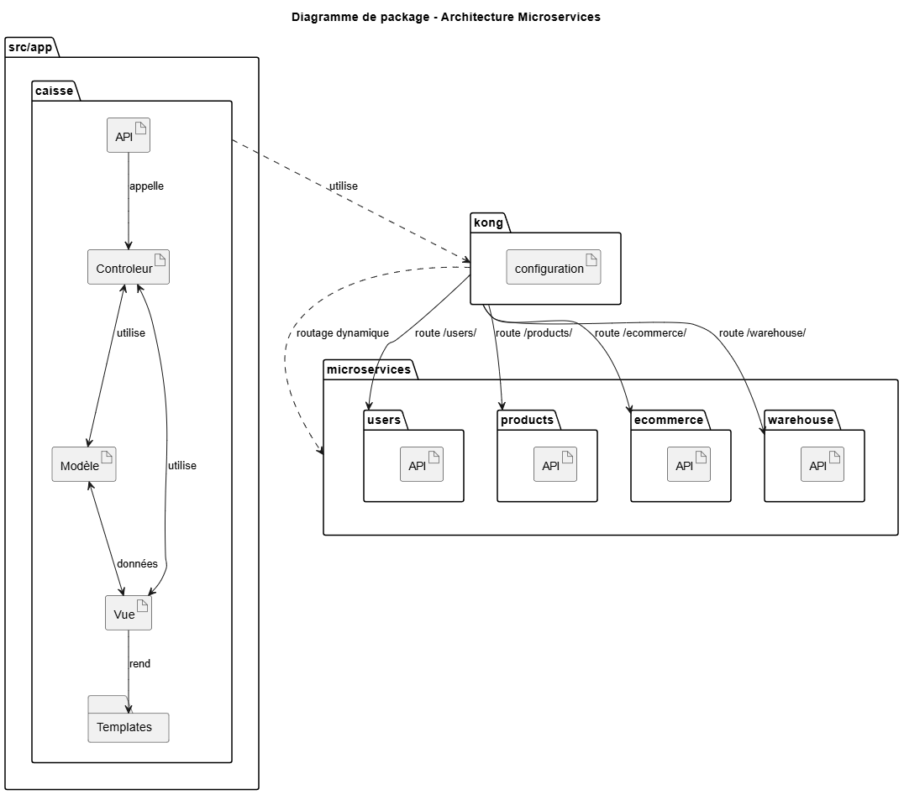

**Level 2** zooms into some building blocks of level 1. Thus it contains
the white box description of selected building blocks of level 1,
together with black box descriptions of their internal building blocks.

N/A

**Level 3** zooms into selected building blocks of level 2, and so on.

N/A

Runtime View 
============
### Diagramme de cas d'utilisation
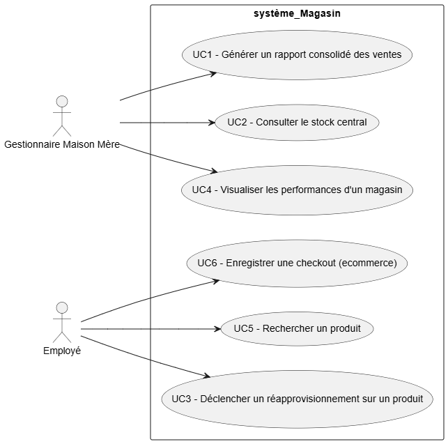
### Diagramme de classe
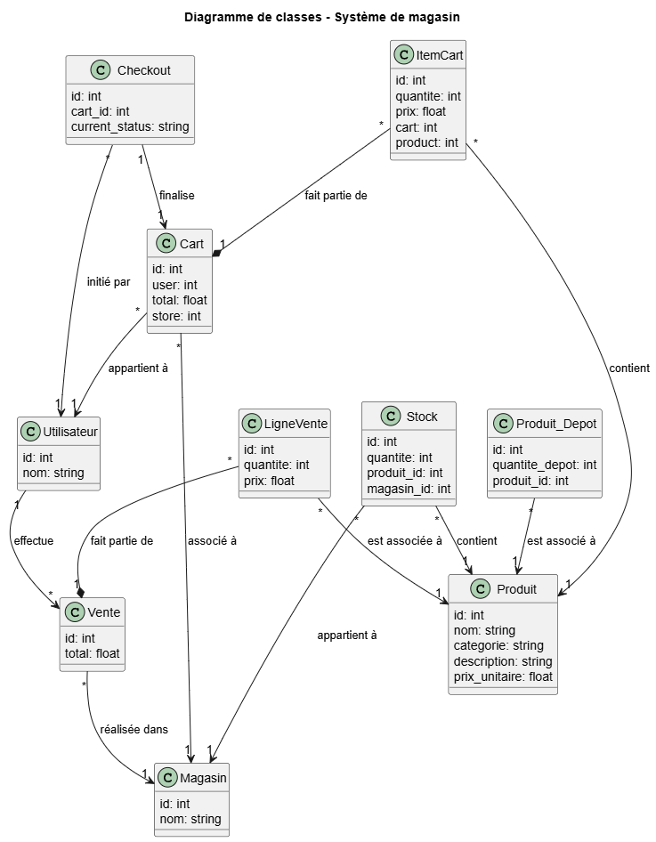

### Diagrammes de sequences 
Voici quelques diagrammes de séquences importantes: 

&lt;Runtime Scénario 1 - UC1 &gt;
--------------------------
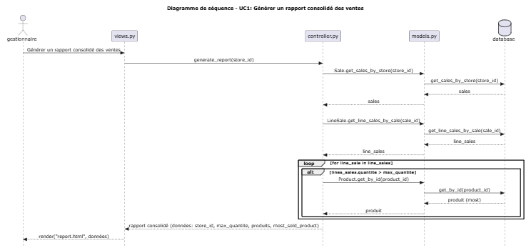

&lt;Runtime Scénario 2 - UC2&gt; 
--------------------------

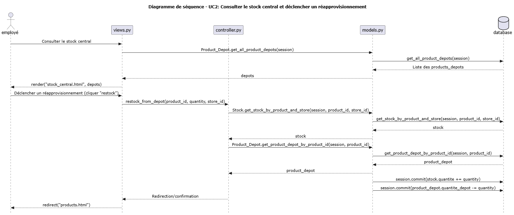

&lt;Runtime Scénario 3 - UC3&gt; 
--------------------------

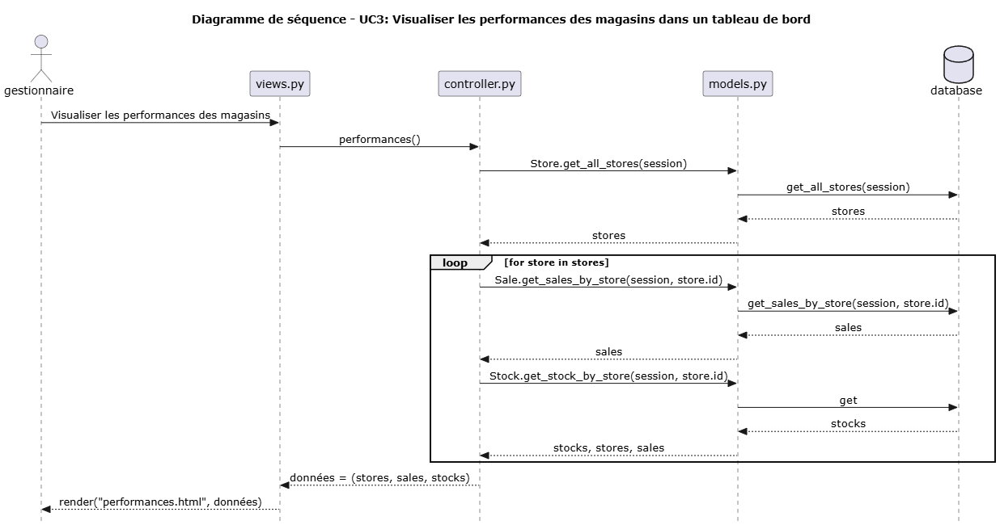

Deployment View 
===============
Ce diagramme représente l'architecture de déploiement hybride du système, montrant la relation entre l'application Django et les nouvelles microservices.

L'infrastructure comprend :

- API Gateway Kong comme point d'entrée unique pour les microservices
- Quatre microservices indépendants (Users, Products, Ecommerce, Warehouse) avec leurs bases de données dédiées
- Ancienne Application Django qui effectue des requêtes vers les nouvelles services.
- Stack de monitoring avec Prometheus et Grafana pour l'observabilité
- Scalabilité horizontale illustrée par les instances multiples du service Warehouse

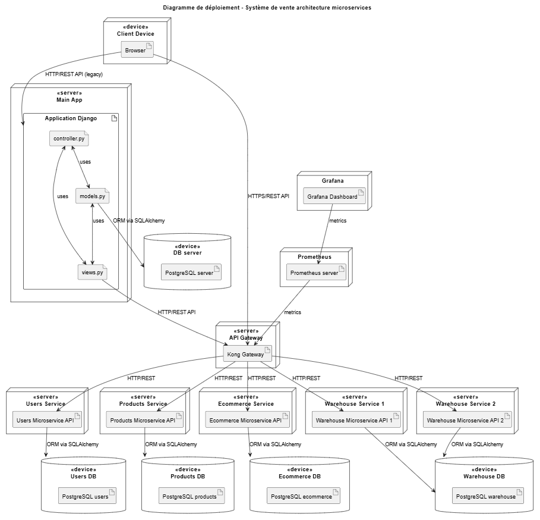

Cross-cutting Concepts 
======================

## UI/UX

L'interface utilisateur suit un principe de simplicité et de clarté pour faciliter l'utilisation par les employés de magasin et les gestionnaires.

Principes de design :

- Navigation intuitive : Chaque cas d'utilisation (recherche produit, achat, gestion stock) est accessible via des sections distinctes
- Consistance visuelle : Même palette de couleurs et composants UI à travers toute l'application

## DDD (Domain Driven Design)

L'architecture microservices reflète une approche Domain Driven Design avec une séparation claire des domaines métiers.

Voici la séparation des domains métiers: 
- Users Domain : Gestion des création des utilisateurs et authentification
- Products Domain : Catalogue produits et informations associées
- Ecommerce Domain : Panier d'achat avec items et processus de vente avec checkout
- Warehouse Domain : Gestion des stocks, réapprovisionnement et logistique pour le stock central

Design Decisions 
================

Voici une liste compréhensives des ADRs prises lors de la conception de ce système: 

# 01 - Architectural decision record: Choix de l'architecture 

## Status

Accepté

## Contexte

Pour rendre notre application plus scalable, il faut évoluer à partir de notre application de base. Cette évolution nous permet d'accepter plus de clients et de rendre notre application plus robuste et maintenable. 

Des architectures possible sont les suivantes: 3-tier, n-tier, architecture hexagonale...
Notre application doit permettre une séparation claire des différentes couches (métier, base de données, interface utilisateur)
## Décision

Architecture 3-tiers a été choisi comme architecture principale. 

## Justification

La raison pour laquelle une architecture 3-tiers a été choisi est parce que la séparation des responsabilités permet au systeme d'être plus flexible et maintenable. De plus, cette architecture permet une évolution vers n-tiers plus facile.  

## Conséquences

- Système plus modulaire et maintenable
- L'ajout de nouvelles fonctionnalités est facile

# 02 - Architectural decision record: Choix du cadriciel MVC

## Status

Accepté

## Contexte

Le système de magasin doit maintenant répondre aux besoins d'une entreprise qui possèdent cinq magasins, un centre de logistique et un maison mère. En conséquence, le système doit évoluer d'une architecture client-serveur vers une architecture 3-tiers. Pour y arriver, une cadriciel web doit être choisi pour implémenter une couche application puis présenter les cas d'utilisations. De nombreux cadriciels se présentent comme solution: FastAPI, Flask, Django
 
## Décision

Django a été choisi comme cadriciel web pour faire évoluer l'application vers une architecture 3-tiers.

## Justification

L'architecture 2-tiers présente de nombreux limites. Il existe un couplage enorme entre la base de donnees et puis le client. Pour effectuer un découplage, on peut se tourner vers une architecture 3-tiers. Django est un cadriciel MVT qui permet de faciliter l'architecture 3-tiers, en decouplant la couche présentation avec les templates, la couche business logic avec leur views et la couche métier avec les models. De plus, Django offre son propre cadriciel pour créer des APIs, ce qui serait idéal si l'on veut évoluer notre application vers cette direction ex. GraphQL ou API REST. 

## Conséquences

- Restreint à l'écosystème Django. 
- Très lourd pour des petits projets
- Facilité vers un grand projet. 

# 03 - Architectural decision record: Transition vers une architecture microservices

## Status

Accepté

## Contexte

L'architecture monolithique actuelle présente des limitations de performance sous charge élevée et des difficultés de maintenance avec l'augmentation de la complexité du système. La croissance en fonctionnalités deviendrait alors un problème. 

Des architectures comme microservices, architecture orientée services, ou même une architecture orientée évènements. 

## Décision

Accepté pour microservices. Migrer vers une architecture microservices avec séparation des domaines métiers : Users, Products, Ecommerce, et Warehouse.

## Justification

- Amélioration des performances sous charge (démontrée par les tests Locust)
- Scalabilité horizontale par service
- Séparation des responsabilités selon les domaines métiers
- Facilite le développement parallèle par équipes

## Conséquences

**Positives :**
- Meilleure performance et résilience
- Évolutivité indépendante des services
- Isolation des pannes

**Négatives :**
- Complexité opérationnelle accrue (configuration de api gateway)
- Besoin d'outils de monitoring distribué

# 04 - Architectural decision record: Choix du cadriciel API pour les services indépendants

## Status

Accepté

## Contexte

Chaque microservice nécessite un framework web léger et performant pour exposer ses APIs REST. Le choix du framework impacte les performances, la maintenabilité et la facilité de développement.

Des options se présentent, comme Django REST Framework, Flask, ou même FastAPI. 

## Décision

Utiliser FastAPI comme framework web pour tous les microservices (Users, Products, Ecommerce, Warehouse).

## Justification

- Performance élevée
- Documentation automatique des APIs (Swagger/OpenAPI)
- Syntaxe moderne et intuitive
- Développement rapide
- Compatible avec l'écosystème Python existant

## Conséquences

**Positives :**
- APIs documentées automatiquement (Documentation OpenAPI déjà existante via url/docs)
- Développement rapide avec validation intégrée
- Excellentes performances
- Facilite les tests d'intégration

**Négatives :**
- Dépendance à un framework relativement récent
- Courbe d'apprentissage pour l'équipe (si non familière avec FastAPI)

Quality Requirements 
====================

N/A

Quality Scenarios 
-----------------

N/A

Risks and Technical Debts 
=========================

| **Risques**             | **Description**                           |
| -------------------- | -------------------------------------------- |
| Pas d'authentification | Le système ne requis pas d'authentification pour y accéder |
| Sécurité négligeable | Le système ne contient pas de mesures sécuritaire pour contrer les attaques |
| Pas de tests API | Absence de tests automatisés pour valider le fonctionnement des APIs des microservices, ce qui augmente le risque de régression lors des déploiements et complique la maintenance. |
| Pipeline CI/CD incomplet | Manque d'automatisation pour l'intégration continue et le déploiement continu |
| Pas d'authentification/d'autorisation sur les APIs | Les APIs des microservices ne requièrent pas de tokens d'authentification, créant une vulnérabilité de sécurité majeure où n'importe qui peut accéder aux services. | 
| Pas de logging centralisé | Du logging locale sont dispersés entre les différents microservices sans centralisation (ex: Loki), rendant le debugging et la surveillance du système très difficiles. | 

Comparison between old architecture and new architecture
========================================================
Pour savoir en quoi l'evolution d'architecture a eu un impact sur le système, un test de charge a été effectué à l'aide du cadriciel Locust et le fichier `locust.py`. Il a été effectuer à deux reprises: lors du laboratoire 4 pour son architecutre monolithique, et lors du laboratoire 5 pour son architecture microservices. Pour y arriver, `locust.py` crée une interface dans laquelle tu peux paramétrer le test de charge. Dans ce cas, 1000 users ont été crées avec un spawn-rate de 20, et ce, qui effectue tous des requêtes vers les API de produits et de stocks après près de 5 minutes. Voici les résultats:

Architecture monolithique
--------------------------
- Dashboard Grafana: 
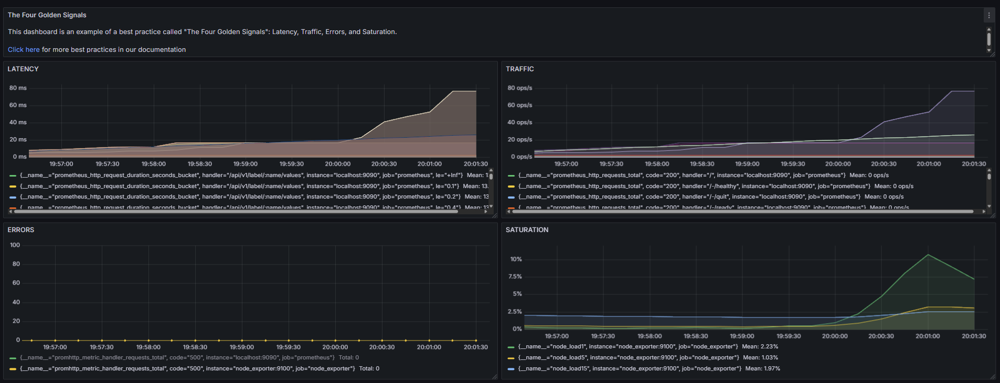
- Graphiques Locust: 
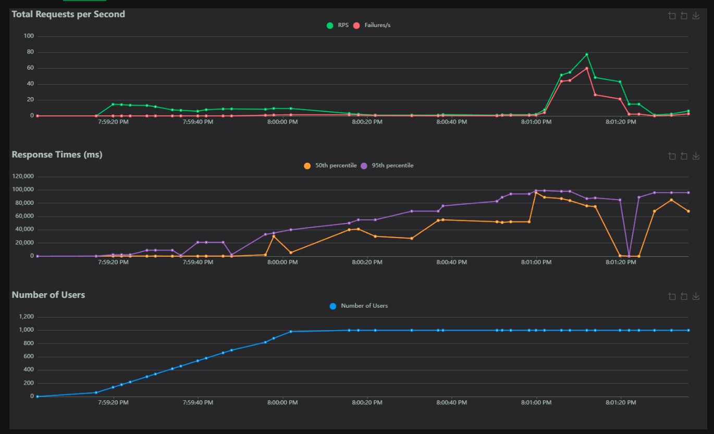
- Statistiques Locust:
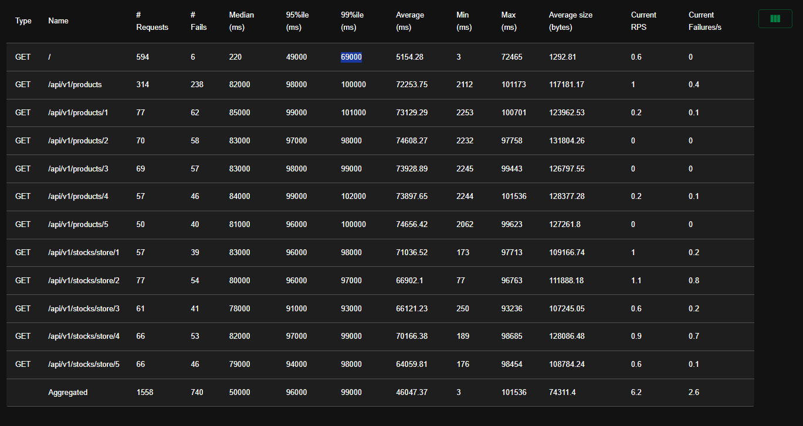

On peut voir que les requêtes vers l'API centrale de notre système monolithique est très limités. D'abord, on peut voir une augmentation majeure sur la latence des réponses. En effet, on voit que le CPU devient surchargé également avec le `node_load1`. De plus, nous voyons clairement le nombre de failures, car l'API n'arrive pas à répondre à toutes les requêtes, ce qui indiquent que l'application éprouve d'une difficulté lorsque la charge est élevée.

Architecture microservices 
--------------------------
- Dashboard Grafana: 
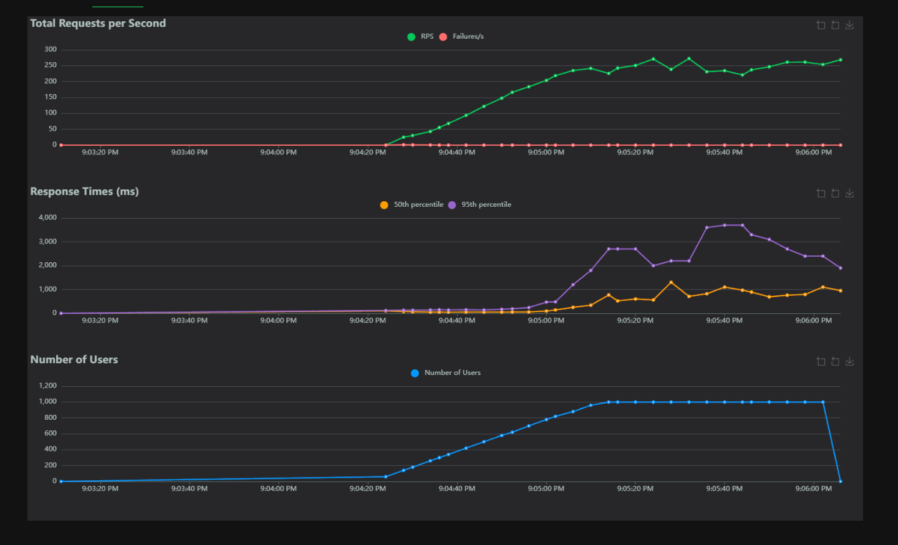
- Graphiques Locust:

- Statistiques Locust:
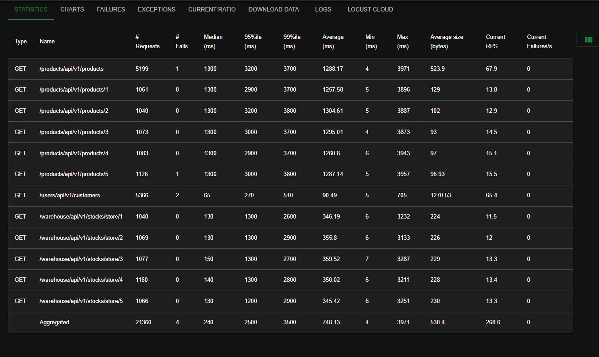

On peut voir que les résultats du test de charge sur l'architecture microservices révèlent une amélioration substantielle des performances par rapport à l'architecture monolithique précédente. Le graphes sur le dashboard Grafana montrent que les métriques restent relativement stables (latence et saturation), ce qui démontre une stabilité lors d'une charge élevée. Le graphique dans Locust permet aussi de voir que le taux de réussite a drastiquement augmenté, car la distribution des requêtes vers les bonnes services permettent une meilleure traitement de requêtes. 
On peut alors conclure que cette transition est une amélioration. 

Glossary 
========

N/A

Lien vers les autres labs
=========================
- Lien vers lab0: https://github.com/LojanArunasalam/LOG430-Lab0 
- Lien vers lab1: https://github.com/LojanArunasalam/LOG430-Lab1 
- Lien vers lab2: https://github.com/LojanArunasalam/LOG430-Lab2 
- Lien vers lab3: https://github.com/LojanArunasalam/LOG430-Lab3 
- Lien vers lab4: https://github.com/LojanArunasalam/LOG430-Lab4 
- Lien vers lab5: https://github.com/LojanArunasalam/LOG430-Lab5 
